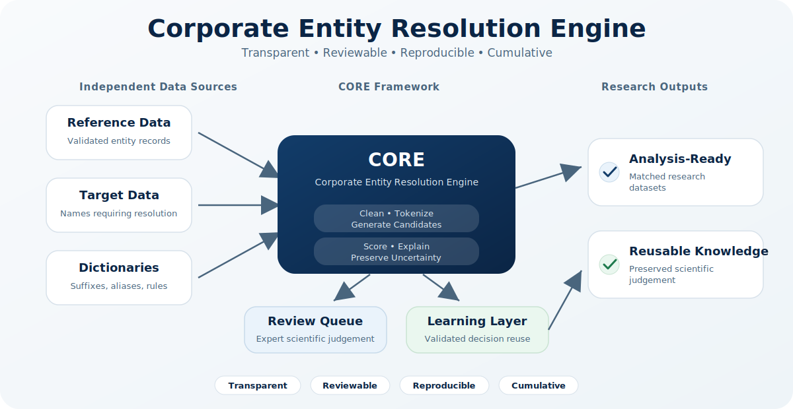

## Transparent. Reviewable. Reproducible. Cumulative.

> **Entity resolution does not merely produce analytical datasets.**
>
> **It produces scientific knowledge.**

<p align="center">
  
</p>

<div style="text-align: center; margin-top: 28px; margin-bottom: 40px;">

<a href="https://corematch.shinyapps.io/core/"
   target="_blank"
   rel="noopener noreferrer"
   class="btn btn-primary btn-lg"
   style="padding: 14px 28px; font-size: 1.15rem;">

🚀 Launch Live Demonstrator

</a>

</div>

CORE is an open-source research software framework designed to support transparent, reviewable, reproducible, and cumulative entity resolution in empirical research.

Rather than treating entity resolution as a disposable data-cleaning task, CORE approaches entity resolution as a scientific process in which computational methods, expert judgement, and validated knowledge work together to produce trustworthy analytical datasets.

Originally developed for corporate entity resolution, CORE has been intentionally designed as a general methodology capable of supporting transparent entity resolution across a broad range of empirical research domains.

---

## Why CORE?

Traditional entity resolution workflows often end once a matched dataset has been produced.

Intermediate decisions, reviewer knowledge, and methodological reasoning frequently disappear with the project, forcing future researchers to reconstruct work that has already been completed.

CORE adopts a different philosophy.

> **Validated entity resolution decisions are scientific knowledge and should be preserved rather than discarded at the conclusion of individual research projects.**

The framework therefore combines:

- transparent computational workflows;
- explicit expert review through the Review Queue;
- preservation of validated scientific judgement;
- reusable knowledge that supports future empirical research.

---

## Core Principles

CORE has been designed around five methodological principles:

- **Transparency**
- **Scientific Judgement**
- **Reproducibility**
- **Knowledge Preservation**
- **Methodological Continuity**

Together, these principles establish entity resolution as a documented and reproducible scientific activity rather than a project-specific preprocessing task.

---

## Framework Components

The CORE ecosystem currently consists of six major components:

| Component | Purpose |
|-----------|---------|
| Entity Resolution Engine | Computational entity resolution workflow |
| Review Queue | Transparent expert evaluation of uncertain matches |
| Learning Layer | Preservation of validated review history |
| Dictionary Infrastructure | Reusable project and community knowledge |
| Documentation Portal | Methodological and architectural documentation |
| Research Software Infrastructure | Reproducibility and software quality support |

---

## Methodological Workflow

CORE implements a six-stage research workflow.

```text
Raw Data
    ↓
Data Acquisition
    ↓
Data Preparation
    ↓
Entity Resolution
    ↓
Expert Validation
    ↓
Knowledge Preservation
    ↓
Analysis-Ready Outputs